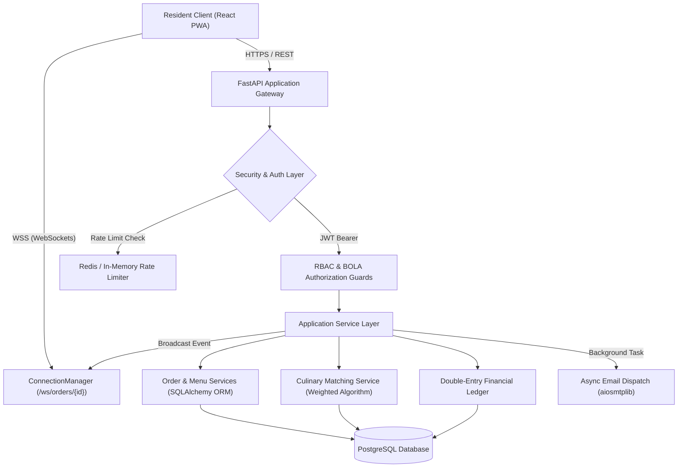
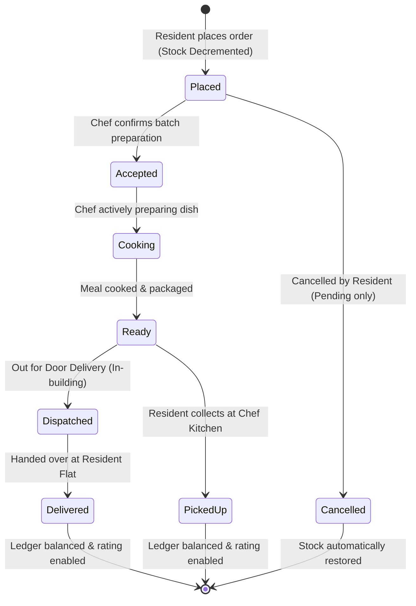

```
  _________            .__       __          ___________                .___
 /   _____/____   ____ |__| _____/  |_ ___.__.\_   _____/___   ____   __| _/
 \_____  \/  _ \_/ ___\|  |/ __ \   __<   |  | |    __)/  _ \ /  _ \ / __ | 
 /        (  <_> )  \___|  \  ___/|  |  \___  | |     \(  <_> |  <_> ) /_/ | 
/_______  /\____/ \___  >__|\___  >__|  / ____| \___  / \____/ \____/\____ | 
        \/            \/        \/      \/          \/                    \/ 
```

# Society Food Platform
> A high-performance, hyperlocal culinary marketplace and apartment community food-sharing network built for residential societies, powered by real-time order tracking, double-entry ledger accounting, and cryptographic multi-tenant security.

---

[](./LICENSE)
[](#)
[](https://fastapi.tiangolo.com)
[](https://react.dev)
[-success.svg)](#)
[-success.svg)](#)
[](#)
[](#)

---

## The Developer's Story

### Project Inspiration
Modern high-rise residential apartment complexes house hundreds—sometimes thousands—of families within a single gated perimeter. Yet, when dinnertime arrives, residents routinely order from distant industrial cloud kitchens and delivery aggregators. These orders arrive lukewarm after battling street traffic, carry steep surge delivery fees, and lack the nutritional warmth of honest home cooking.

At the exact same moment, three floors above or down the hallway, talented resident home chefs prepare regional delicacies, authentic family recipes, and fresh evening snacks for their own households.

**The Society Food Platform** was founded on a simple question: *Why should neighbors order anonymous factory takeout when authentic, wholesome, fresh meals can be cooked and enjoyed right inside our own residential community?* 

We set out to create a trusted, hyper-local peer-to-peer food economy. By removing third-party delivery vehicles, eliminating marketplace commission gouging, and anchoring trust in apartment flat verification, our platform connects passionate resident chefs with hungry neighbors for daily home-cooked meals, weekend specials, and community cravings.

---

### Meet the Architecture
The platform is designed as a **Hyperlocal Micro-Marketplace**. Unlike city-wide food apps that prioritize geographic routing algorithms, our technical constraints revolve around **temporal batches, portion caps, and residential trust**:
1. **Zero-Distance Delivery & Pickup**: Orders move across elevator shafts rather than traffic intersections.
2. **Batch Concurrency**: Home kitchens prepare finite batches (e.g. 10 portions of Hyderabadi Biryani). When the tenth portion is claimed, inventory must instantly lock across all connected client interfaces.
3. **Multi-Role Workspaces**: Clean role separation between **Resident**, **Home Chef (Partner)**, **Society Admin**, and **Super Admin** with zero database mutation on workspace switching.

---

### Platform Role Structure & RBAC Matrix

| Role | Access Scope | Core Responsibilities & Workspaces |
| :--- | :--- | :--- |
| **Resident Member** | Resident Space | Browse neighbor dishes, order fresh batches, post cravings, track doorstep delivery. |
| **Home Chef (Partner)** | Kitchen Hub Subpages | Manage daily batches, portion steppers, dish cloning, storefront branding, and Direct UPI revenue. |
| **Society Admin** | Admin Console Subpages | Supervise community health, verify chef applicant licenses, manage member directory, audit refunds. |
| **Super Admin** | Multi-Society Governance | Platform-wide telemetry, cross-society provisioning, SaaS pass fee configuration, global dispute oversight. |

---

### Key Engineering Challenges & Solutions

#### 1. Modular Sub-Pages & Outlet Navigation
- **Challenge**: Monolithic dashboard components caused render bottlenecks and made maintenance cumbersome.
- **Solution**: Decomposed workspace portals into dedicated subpage modules rendered via React Router `<Outlet />`:
  - **Partner Workspace (`/partner/*`)**: `/partner` (Overview), `/partner/orders`, `/partner/menu`, `/partner/gallery`, `/partner/finances`.
  - **Admin Console (`/admin/*`)**: `/admin` (Overview), `/admin/approvals`, `/admin/residents`, `/admin/refunds`.

#### 2. Profile Action Sub-Menu & Zero Legacy Conventions
- **Challenge**: Onboarding residents as home chefs previously required complex role migrations or risked account demotions.
- **Solution**: Built an **Account Services & Action Menu** on `/profile` with intuitive navigation cards and a streamlined application modal. Completely eliminated legacy `buyer` and `seller` terminology across all interfaces in favor of `Resident Member`, `Home Chef (Partner)`, and `Society Admin`.

#### 3. Concurrency & Portion Integrity
- **Challenge**: Multiple residents ordering the last available portion of a dinner special simultaneously could cause overselling and chef distress.
- **Solution**: Implemented atomic stock decrement logic directly in the transactional pipeline [`order_service.py`](file:///c:/Users/91868/Documents/GitHub/food-platform-docs/backend/app/services/order_service.py). Placing an order validates inventory and decrements stock in real time; when portions reach zero, the item automatically switches to `Sold Out` across the marketplace.

#### 4. Self-Order Prevention & Platform Accounting Safeguards
- **Challenge**: If a chef places orders to their own kitchen while operating in resident mode, double-entry payout balances and escrow ledgers are corrupted.
- **Solution**: Embedded a strict guard in `create_order` rejecting any transaction where `buyer_id == seller_id` with HTTP 400 (`"Chefs cannot place orders from their own kitchen."`). Replaced action controls on self-menus with non-interactive *"Your Kitchen"* badges.

#### 5. Broken Object Level Authorization (BOLA / IDOR) Defense
- **Challenge**: Numeric IDs for orders (`/api/v1/orders/{id}`) could allow malicious users to inspect or cancel orders belonging to other flats.
- **Solution**: Reinforced endpoint dependencies in [`orders.py`](file:///c:/Users/91868/Documents/GitHub/food-platform-docs/backend/app/api/v1/orders.py) ensuring that only the resident who placed the order (`order.buyer_id == current_user.id`), the chef preparing it (`order.seller_id == current_user.id`), or a platform admin can read order details or update delivery status.

#### 6. Cryptographic Passwordless Authentication & Role Protection
- **Challenge**: Standard PRNG functions can be predictable, and login role toggles could accidentally downgrade privileged administrator accounts.
- **Solution**: Secured [`security.py`](file:///c:/Users/91868/Documents/GitHub/food-platform-docs/backend/app/core/security.py) with Python's `secrets.choice(string.digits)`, enforced a 5-minute OTP expiry with single-use consumption, and protected `admin` / `super_admin` accounts in [`auth.py`](file:///c:/Users/91868/Documents/GitHub/food-platform-docs/backend/app/api/v1/auth.py) so they can never be demoted on login or OTP verification.

#### 7. Direct P2PM UPI & Zero-Commission SaaS Pass Model
- **Challenge**: 2-3% payment gateway MDR fees drain resident chef margins on low-ticket home-cooked portions.
- **Solution**: Engineered a peer-to-peer merchant Direct UPI architecture. Residents scan dynamic chef UPI QR codes with pre-filled amounts and submit 12-digit bank UTRs for instant 1-tap chef confirmation. The platform sustains operations through a SaaS Pass providing 50 free orders/month and a flat ₹5.00/order maintenance fee thereafter via a prepaid platform credit wallet.

---

## System Specifications

### Technical Component Table
| Layer | Technology | Version | Purpose |
| :--- | :--- | :--- | :--- |
| **Backend Framework** | FastAPI (Python) | 3.12 / 0.110+ | Asynchronous REST API, WebSockets, background tasks |
| **Database & ORM** | PostgreSQL + SQLAlchemy | 14+ / 2.0+ | Relational persistence, JSON item structures, migrations |
| **Schema Migrations** | Alembic | 1.13+ | Automated revision history & declarative migrations |
| **Cache & OTP Store** | Redis | 7.0+ | TTL-managed OTP secrets and rate-limiting counters |
| **Real-Time Push** | WebSockets | Native Starlette | Real-time kitchen order status & door dispatch alerts |
| **Frontend Framework** | React + PWA | 18.2+ | Progressive Web App with offline caching & mobile responsiveness |
| **Component UI** | Material UI (MUI v5) | 5.15+ | Glassmorphic theme system, custom cards, accessible dialogs |
| **Containerization** | Docker & Compose | 24+ | Multi-container isolation with unprivileged non-root runtime |

---

## Architectural Overview & Mermaid Pipelines

### 1. System Request & Data Pipeline


### 2. Order Lifecycle State Machine


---

## Project Folder Blueprint

```
food-platform-docs/
├── backend/
│   ├── app/
│   │   ├── api/
│   │   │   ├── dependencies.py          # Auth, DB, and RBAC injection
│   │   │   └── v1/
│   │   │       ├── admin.py             # Society Admin & telemetry endpoints
│   │   │       ├── auth.py              # Cryptographic OTP & role-safe auth
│   │   │       ├── menus.py             # Dishes, inventory, portions, images
│   │   │       ├── orders.py            # Order placement, BOLA guards, tracking
│   │   │       ├── payments.py          # SaaS pass, maintenance ledger, UPI
│   │   │       ├── sellers.py           # Kitchen profiles, showcase photos
│   │   │       └── suggestions.py       # Community cravings & matching API
│   │   ├── core/
│   │   │   ├── config.py                # Pydantic environment configurations
│   │   │   └── security.py              # Secrets-based OTP, bcrypt, JWT tokens
│   │   ├── db/
│   │   │   ├── database.py              # SQLAlchemy engine & session factory
│   │   │   └── models/                  # User, Order, Menu, Ledger models
│   │   ├── schemas/                     # Pydantic validation contracts
│   │   └── services/                    # Order, matching, and WebSocket services
│   ├── Dockerfile                       # Non-root hardened container specification
│   ├── entrypoint.sh                    # DB wait, Alembic migrations, startup
│   └── tests/                           # 44 Pytest automated tests (100% pass)
│
├── frontend/
│   ├── public/                          # Fonts, manifest, and icons
│   ├── src/
│   │   ├── components/                  # CartDrawer, Lightbox, Navigation
│   │   ├── pages/
│   │   │   ├── admin/                   # Admin Layout & 4 Modular Subpages
│   │   │   │   ├── AdminLayout.jsx      # Header shell, supervisor tabs
│   │   │   │   ├── AdminOverview.jsx    # GMV analytics & platform KPIs
│   │   │   │   ├── AdminApprovals.jsx   # Chef applicant review queue
│   │   │   │   ├── AdminResidents.jsx   # Resident & unit account directory
│   │   │   │   └── AdminRefunds.jsx     # Dispute resolution & refund ledger
│   │   │   ├── partner/                 # Partner Layout & 5 Modular Subpages
│   │   │   │   ├── PartnerLayout.jsx    # Persistent shell, order badge, SaaS meter
│   │   │   │   ├── PartnerOverview.jsx  # Kitchen health, batch prep sheet
│   │   │   │   ├── PartnerOrders.jsx    # Live fulfillment order pipeline
│   │   │   │   ├── PartnerMenu.jsx      # Portions, availability, clone dish
│   │   │   │   ├── PartnerGallery.jsx   # Storefront branding & curated presets
│   │   │   │   └── PartnerFinances.jsx  # SaaS pass meter, Direct UPI, fee ledger
│   │   │   ├── BuyerDashboard.jsx       # Resident home marketplace
│   │   │   ├── Menu.jsx                 # Kitchen catalog & portion steppers
│   │   │   ├── Orders.jsx               # Visual order tracking timeline
│   │   │   ├── Profile.jsx              # Profile & Account Services Action Menu
│   │   │   └── SuggestionsBoard.jsx     # Community Cravings Radar
│   │   ├── services/api.js              # Axios client with session hygiene
│   │   ├── App.jsx                      # Universal login, smart routing, theme
│   │   └── __tests__/                   # 40 Jest tests across 14 suites (100% pass)
│   ├── nginx.conf                       # Reverse proxy & SPA routing fallback
│   └── Dockerfile                       # Multi-stage React + Nginx build
│
├── docker-compose.yml                   # Local development stack (hot reload)
├── docker-compose.staging.yml           # Staging environment stack
├── docker-compose.prod.yml              # Production hardened stack
└── README.md                            # Complete platform manual (this file)
```

---

## Docker Setup & Deployment Guide

The platform provides dedicated Docker Compose configurations for every deployment tier:

| Compose File | Target Environment | Purpose & Characteristics |
| :--- | :--- | :--- |
| `docker-compose.yml` | **Development** | Source bind-mounts for instant hot-reload, dev database, Redis cache. |
| `docker-compose.staging.yml`| **Staging** | Production-like multi-container stack with Nginx proxy and migration checks. |
| `docker-compose.prod.yml` | **Production** | Optimized multi-worker backend (`WORKERS=4`), healthcheck dependencies, restart policies. |

### 1. Development Mode (Hot-Reload)

```bash
# Start dev stack
docker compose -f docker-compose.yml up -d --build

# View container logs
docker compose -f docker-compose.yml logs -f backend
```

- **Frontend**: `http://localhost:3000`
- **Backend API**: `http://localhost:8000`
- **Swagger Docs**: `http://localhost:8000/docs`

### 2. Staging Deployment

```bash
# Start staging stack
docker compose -f docker-compose.staging.yml up -d --build

# Verify container health
docker compose -f docker-compose.staging.yml ps
```

### 3. Production Deployment

```bash
# Configure production secrets in .env
# Start production stack
docker compose -f docker-compose.prod.yml up -d --build
```

---

## Testing & Quality Assurance Matrix

### Backend Pytest Suite: **44/44 Passed (100%)**
```bash
cd backend
.\.venv\Scripts\python -m pytest tests/ -v
```
All 44 automated backend tests validate auth demotion protection, OTP rate-limiting, portion decrements, BOLA checks, direct UPI calculations, cravings matching, and delivery routing.

### Frontend Jest Suite: **40/40 Passed Across 14 Suites (100%)**
```bash
cd frontend
npm test -- --watchAll=false
```
All 14 suites validate subpage mounting (`partner-subpages.test.jsx`, `admin-subpages.test.jsx`), profile action menu, SaaS pass meters, dish editing, drawer checkout, and persona navigation.

---

## Frequently Asked Questions (FAQ)

**Q: Can a resident apply to become a Home Chef?**  
A: Yes! Residents simply open the **Account Services & Action Menu** on their Profile page and tap *"Apply as Home Chef"*. Once approved by the Society Admin, their Kitchen Hub activates immediately.

**Q: How does the Direct UPI model work without payment gateway charges?**  
A: Residents scan the chef's personalized UPI QR at checkout and submit their bank UTR. Funds settle directly into the chef's bank account with 0% platform commission. The platform maintains services via a prepaid SaaS pass (50 free orders included).

**Q: Can an Administrator account be downgraded on login?**  
A: No. The backend authentication layer strictly protects `admin` and `super_admin` accounts from accidental demotion regardless of client inputs.

---

## Licensing
This project is licensed under the **MIT License** — see the [LICENSE](./LICENSE) file for details.
